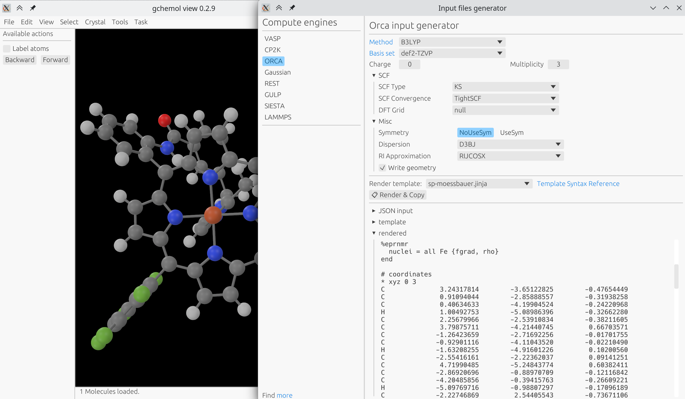
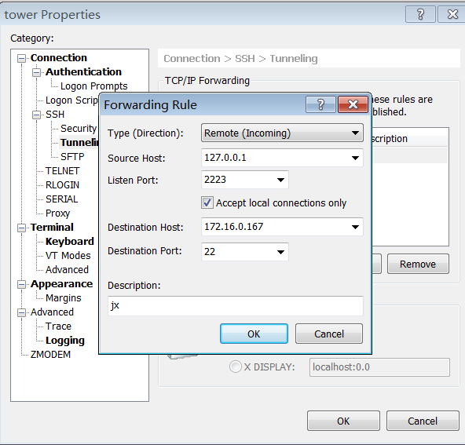

# Introduction

gchemol-view is a simple molecule viewer based on [gchemol](https://github.com/gchemol/gchemol) and [bevy](https://bevyengine.org/).

# Interesting features

-   Lightweight molecule viewer: fast to load molecule with thousands of atoms
-   Remote view: view molecules locally sent from a remote client in the
    terminal without an X environment

# Install

## Binary install

Download prebuilt binary for Linux/Windows/MacOS on the [release](https://github.com/ybyygu/gchemol-view/releases) page.

## Compile from sources

-   follow [bevy setup guide](https://bevyengine.org/learn/book/getting-started/setup/)

Linux GTK is required for using native file dialog:
On Ubuntu:

    sudo apt-get install libgtk-3-dev

# How to use

Visualization of molecules from common file formats supported by [gchemol](https://github.com/gchemol/gchemol-readwrite/tree/master/src/formats)

    gchemol-view foo.xyz
    gchemol-view POSCAR
    gchemol-view foo.cif

# View molecule sent from the command line without an X environment

You can view a molecule in gchemol-view on your local machine that was
sent from a remote HPC server in command line using [spdkit-python](https://github.com/spdkit/python/releases).

    from spdkit import *
    
    mol = Molecule.from_file("foo.mol2", remote=True)
    view(mol, remote=True)

To achieve this, you need a working reverse SSH channel.

## How to setup in Linux

Setup reverse port forwarding from desktop to remote SSH server:

    ssh -N -R remote-port:localhost:3039 remote-ssh-server

To automatically set up a reverse channel when logging into a remote
SSH server, you can create an entry in your ~/.ssh/config file.

    host Khpcserver01
        hostname remote-ssh-server
        ExitOnForwardFailure yes
        RemoteForward {{remote-port}} localhost:3039

## How to setup in Windows

If you are using XShell, you can refer to the image below:

# Todo List

-   [ ] set atom freezing codes for optimization
-   [ ] select atoms by atom serial numbers
-   [ ] measure distance, angle, torsion angle
-   [ ] visuailize volume data: orbital, DOS, etc.
-   [ ] better animation system

# Credits

Codes that inspired me:

-   [Plonq/bevy\_panorbit\_camera: A simple pan and orbit camera for the Bevy game engine](https://github.com/Plonq/bevy_panorbit_camera)
-   [NightsWatchGames/rubiks-cube: Rubik's cube made with bevy engine.](https://github.com/NightsWatchGames/rubiks-cube)

