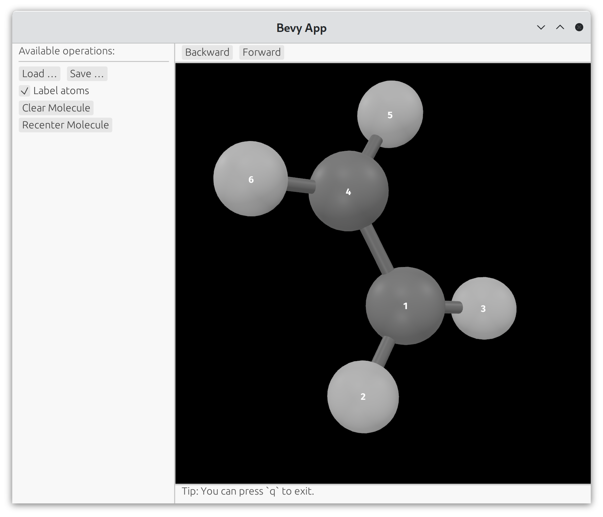

# Introduction

gchemol-view is a simple molecule viewer based on [gchemol](https://github.com/gchemol/gchemol) and [bevy](https://bevyengine.org/).

# Features

-   [X] visualization of atom, bond and lattice
-   [X] visualization of molecule trajectory (Left/Right key for next/previous frame)
-   [X] mouse control for view like in GaussView

# Install

Download prebuilt binary for Linux on the [release](https://github.com/ybyygu/bevy-atoms/release) page.

# How to use

Visualization of molecules from common file formats supported by [gchemol](https://github.com/gchemol/gchemol-readwrite/tree/master/src/formats)

    gchemol-view foo.xyz
    gchemol-view POSCAR
    gchemol-view foo.cif

Visualization of molecule trajectory (use arrow key to control the frame):

    gchemol-view traj.xyz

# Todo List

-   [ ] better light system
-   [ ] fix visualiation of lattice in trajectory animation
-   [ ] label atoms
-   [ ] set atom freezing codes for optimization
-   [ ] select atoms by atom serial numbers

